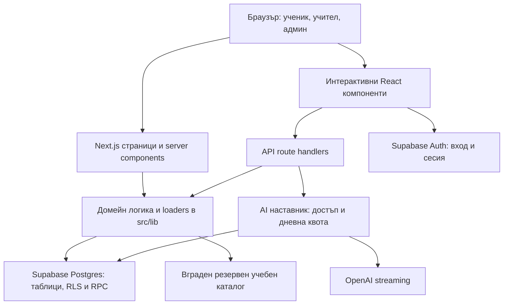

# Архитектура и функционалност — 8 септември 2026

## Извод и обхват

Learning Lesson v2 има подходяща архитектурна основа за ограничен училищен пилот. Реализацията е значително по-напред от предоставения 30-дневен backlog: възлагане, реална опашка за проверка, собствени учителски задачи и дневник с CSV вече съществуват. Приоритетът е проверка и довършване на учебния цикъл, обработката на грешки и тестовете с реална база.

Това е анализ на локалния код и миграциите. Не е потвърждение на текущото production състояние. Не са проверявани приложените миграции в отдалечения Supabase, deployment конфигурацията, реални ученически/учителски сесии или реална OpenAI заявка. Старият `docs/platform-full-audit.md` съдържа исторически твърдения за deployment, които не са използвани като текущо доказателство.

Проверки в тази сесия: `npm run lint`, `npm run typecheck` и `npm test` минаха успешно; 96 тестови файла, 547 теста. Не са изпълнявани production build, Playwright или SQL integration suite. Направени са и две безопасни локални репродукции на чиста логика, описани по-долу. Продуктовият код и базата не са променяни.

## 1. Архитектурна карта

Стекът в `package.json`: Next.js 15.5.22 с App Router, React 19, TypeScript, Tailwind, Supabase Auth/Postgres и Vercel AI SDK с OpenAI provider. Локално има 49 страници, 36 API route файла и 48 SQL миграции.



Това е едно приложение с отделени домейни. Основните правила за мутации са в SQL RPC функции: предаване, проверка, членство, оценяване и XP. Next.js страниците четат данни на сървъра, а клиентските компоненти управляват форми, чернови и AI отговори.

**Силни страни:**

- Домейните имат собствени модули: `curriculum`, `catalog`, `assignments`, `assessments`, `gradebook`, `mentor`, `inbox`.
- Има отделни проверки за потребител, учител и админ; учителска регистрация не дава автоматично teacher права. Виж `src/lib/supabase/auth.ts`, `teacher-auth.ts`, `admin-auth.ts`, `profile.ts`.
- Чувствителните операции използват авторизация и в SQL. Миграциите съдържат RLS, private функции, ограничени grants и проверки за принадлежност към клас. Това трябва да се потвърди и чрез изпълнявани DB тестове.
- Предаването има контролирани преходи и история на ревютата в `20260903140000_lock_assignment_resubmit.sql`.
- Учебният прогрес се потвърждава през `complete_lesson`; браузърът не изпраща свободно избран брой XP. Guest progress има отделен механизъм за доказване и прехвърляне.
- Има централизирани публични кодове за грешки, структурирано логване и защита срещу включване на fake auth във Vercel deployment.

За този етап не виждам основание за разделяне на микросървиси или смяна на стека. Полезното развитие е по-ясна граница между домейн правилата, заявките към базата и UI състоянията.

## 2. Реална функционална картина

„Реализирано“ тук означава проследима реализация в кода и миграциите, а не live проверка на всички сценарии.

| Област | Реализация | Ограничение / следваща проверка |
| --- | --- | --- |
| Публична част | `/demo`, `/for-teachers`, контакт и информационни страници | Примерният teacher proof не доказва работа с реален клас |
| Регистрация и роли | Вход, регистрация, потвърждение, reset; teacher promotion от админ | Общият login още има етикет „Ученик“; отказът за panel достъп е redirect |
| Класове | Създаване, join code, roster, co-teacher, архивиране и прехвърляне | Няма school/organization модел за отделен училищен админ |
| Възлагане | Мисия от програма или собствена задача с 1–8 въпроса, срок, инструкции | Успешното действие няма устойчиво видимо потвърждение |
| Предаване и ревю | Submit, реална pending опашка, approve / needs_changes, бележка, повторно предаване | Необходим е реален цикъл с два акаунта и отрицателен тест с чужд клас |
| Проверки на знания | Ученически опит, автоматично оценяване, резултати, анализ по въпроси | Изпълняваните локални тестове не доказват live SQL и RLS |
| „Днес“ и Inbox | Следваща стъпка, срокове, върнати задачи, feedback | Изборът на основна задача може да даде приоритет на вече предадена работа |
| Уроци и игрови прогрес | Етапи на урока, knowledge check, XP, streak, проекти, сертификати | XP/streak не са показани като основни показатели на „Днес“ |
| AI | В зададена от учител задача; start/review/explain; streaming; дневна квота | Историята и лимитът от три подсказки за задача са локално UI състояние |
| Отчети | Дневник по клас и CSV export | CSV има риск от формули; много заявки при натрупване на задания |
| Учебна програма | Основа за VIII клас и четири професионални направления; връзки към лаборатории | Това не е завършена програма за IX–XII клас |
| CMS | Редакция на съществуващи учебни записи, seed с флаг | Няма пълен create/delete редактор за съдържанието |

AI вече е свързан с `assignmentId`, не с произволен урок. `src/app/api/mentor/route.ts` проверява ученическа сесия, достъп до класа и отворен статус на предаването. `e2e/mentor.spec.ts` изрично очаква липса на наставник в етапа на обикновен урок. README и старият одит описват предишното поведение.

## 3. Конкретни проблеми и рискове

### Висок приоритет: CSV допуска формули от потребителски текст

`src/lib/gradebook/csv.ts:3` обработва кавички и разделители, но не защитава клетките от интерпретация като формула. `src/lib/display-name.ts` допуска `=1+1` като валидно име.

Локално потвърдено чрез изпълнение на текущите функции:

```text
isValidDisplayName('=1+1') -> true
CSV ред -> =1+1,0,0
```

Това е риск при отваряне на експорта в Excel или друга програма, която изпълнява формули. Не е извършвана експлоатация или отваряне в spreadsheet приложение. Необходима е обща политика за безопасен износ на всички текстови полета и тестове за имена, заглавия и други потребителски стойности. Виж [OWASP: CSV Injection](https://owasp.org/www-community/attacks/CSV_Injection).

### Висок приоритет: реалният учебен цикъл не е доказан от текущите тестове

`playwright.config.ts` включва fake auth и placeholder Supabase адрес. `e2e/teacher.spec.ts` симулира създаването на клас, а `e2e/mentor.spec.ts` симулира AI отговорите. Част от migration тестовете проверяват текст в SQL файлове, без да изпълняват SQL. Няма локална директория `supabase/tests`.

Следствие: зелени тестове могат да съществуват едновременно с липсваща миграция, дефектно RPC или грешни права в реалната база. Нужен е изолиран интеграционен сценарий: учител възлага → ученик предава → учител вижда опашката → връща с бележка → ученик предава отново → учител одобрява. Да се включат catalog и custom задача, co-teacher и отказ за чужд клас. RLS трябва да се проверява чрез реални allow/deny заявки; това съответства на [Supabase RLS документацията](https://supabase.com/docs/guides/database/postgres/row-level-security).

### Среден приоритет: грешен AI лимит при неуспешен отговор

`src/components/assignment-mentor-help.tsx:88` прави `Number(response.headers.get("X-Mentor-Remaining"))`. Липсващ header връща `null`, а `Number(null)` е `0`. Така отговор за грешка без този header може да покаже изчерпана квота и да блокира CTA до презареждане/успешно обновяване.

Преобразуването и приемането на резултата като валиден остатък са потвърдени локално. Да се проверяват наличието и форматът на header-а преди преобразуване.

### Среден приоритет: AI историята и лимитът за задача не са устойчиви

`src/components/assignment-mentor-help.tsx:98` пази разговорите в `useChat`. Не е реализирано зареждане или записване на тези съобщения. Лимитът от три подсказки се изчислява от локалната история. При презареждане историята се губи и броячът за конкретната задача започва отначало. Сървърът валидира нивото 1–3, но не проверява натрупан брой подсказки за тази задача. Дневната DB квота остава отделна защита.

Допълнително: формата за предаване допуска 10 000 символа текст и 2 000 символа URL и изпраща съчетанието им като effort. AI API отхвърля effort над 1 600 символа. Следователно валидна по-дълга ученическа чернова може да направи AI помощта недостъпна. Виж `submit-assignment-form.tsx` и `src/app/api/mentor/route.ts:18`.

Квотата се резервира преди заявката към доставчика и не се възстановява при грешка. Това поведение е изрично покрито от тест. Нужно е продуктово решение дали лимитът означава опити или получени подсказки, и съответстващ текст в интерфейса.

### Среден приоритет: „Днес“ може да насочва към вече предадена работа

`src/app/dashboard/page.tsx:44` избира първо `needs_changes`, след това `submitted`, после друга неодобрена задача. Ако няма активна проверка или върната задача, предадена работа може да измести непредадена задача, въпреки че ученикът чака учителя и не може да я редактира.

Inbox използва различни правила за приоритет. Добра следваща стъпка е една споделена функция за следващо изпълнимо действие, със срок и необходимост от ученическа намеса. Предадените задачи да останат видими като „Чака проверка“.

### Среден приоритет: резервният каталог скрива проблеми с данните

`src/lib/catalog/index.ts:20` и `src/lib/curriculum/index.ts:24` преминават към вграден каталог при грешка или празни резултати от базата. При curriculum това става без логване. При класовете и заданията подобни проблеми предизвикват явна грешка чрез `throwLoadError`.

Следствие: учителят може да вижда резервно учебно съдържание, докато възлагането и оценяването продължават да зависят от реалните DB записи. Нужно е разграничаване между разрешен demo/offline fallback и production повреда, с ясно съобщение за деградирал режим.

### Среден приоритет: обратната връзка при действия е непоследователна

В `src/components/teacher/assign-mission-form.tsx:133` успехът се записва, но формата веднага се затваря. Затвореният компонент връща само бутон, затова съобщението за успех остава скрито. `copy-code-button.tsx:24` поглъща clipboard грешката без съобщение. CSV бутонът също няма собствено състояние за грешка.

P0.3 е реална нужда, но целта е ясно и достъпно потвърждение на действията. Не е необходимо всеки вид feedback непременно да бъде toast.

### При растеж: дневникът прави заявка за всяка задача и проверка

`src/lib/supabase/gradebook.ts:13` зарежда три основни набора, после отделен report за всяка задача и проверка. При A задания и Q проверки това са 3 + A + Q операции за отчетите, извън auth/session заявките. Паралелното изпълнение намалява чакането, но не броя операции.

Това е доказан модел на заявките, не измерен production performance проблем. Преди използване с големи класове/натрупани периоди: измерване и обща заявка/RPC за дневника, филтър по период и при нужда pagination. Каталогът също се зарежда целият при търсене на отделен урок.

## 4. Моделът на продукта

Има две свързани, но различни системи: курсове/уроци с XP и учебни мисии/задания с учителска проверка. Връзката е `curriculum_mission_labs`. Това е полезно разделение, ако UI ясно обяснява „предадена задача“, „одобрена работа“ и „завършен урок“.

Следващото развитие трябва да съгласува тези състояния в „Днес“, класния отчет и мисията. Не е нужно одобрението на всяка задача автоматично да носи същия XP като завършен урок; това е отделно продуктово правило.

Няма модел за училище, организационно членство и ограничен училищен админ. Това е бъдещ архитектурен етап за работа с отделни училища, а не пречка за малък пилот с управление от оператора. Миграцията за имена от 4 септември умишлено разпространява учителска промяна в глобалния профил и всички класни членства; този обхват трябва да се преразгледа при въвеждане на училищна изолация.

## 5. Корекция на 30-дневния backlog

| Елемент | Статус според локалната реализация |
| --- | --- |
| P0.1 sticky/overlap | Новият header и `#site-scroll` са реализирани; визуалните тестове не са повторени в този анализ |
| P0.2 sync имена | Има миграция от 4 септември; live прилагането не е проверено |
| P0.3 feedback | Частично; конкретни пропуски са потвърдени по кода |
| P0.4 reviews ← submissions | Реализирано, включително custom задачи чрез миграцията от 20 август; следва интеграционна проверка |
| P0.5 роли/login/404 | Авторизация има; общият login е означен като ученически, няма custom `not-found.tsx` |
| P0.6 година | Daily challenge вече използва 2026; това е фиксирана отправна дата, която не изисква ежегодна промяна |
| Бързо възлагане | Реализирано; подобрение на UX, не изграждане от нулата |
| AI история и лимити | Частично; нужни са уточнен договор и устойчиво съхранение |
| Публичен join | Няма `/join`; join код се въвежда след вход в `/classes`. Текущият hero води към регистрация |
| XP/streak на „Днес“ | Остава продуктов пропуск |
| VET и CSV | VET основа и CSV export съществуват; CSV import на roster е отделна, нереализирана задача |

Не бива да се сменя останалото `2024` в `src/lib/datetime/calendar.ts`: там датата 1 януари 2024 служи за известен понеделник при подреждане на дните, а не за показване на текуща година.

## 6. Препоръчан ред

1. Безопасен CSV export; поправка на AI header parsing и загубените потвърждения при действия.
2. Реален интеграционен цикъл с teacher/student/co-teacher и отрицателни проверки за чужд клас; проверка на миграциите в целевата среда.
3. Единни правила за „следващо действие“ на „Днес“ и Inbox; отделяне на чакащите проверка задачи.
4. Решение за AI история, лимит на задача, дълги чернови и неуспешни заявки; след това изпълнение.
5. Уеднаквяване на поведението при DB грешка; актуализиране на README, одита и backlog-а.
6. Използване в реален час и измерване на времето за възлагане, предаване и проверка. Оптимизация на отчетите при наблюдавана нужда.

Критерият за готовност е наблюдаван и повторяем учебен цикъл, включително грешки и повторно предаване, с разбираеми състояния за двете роли.
