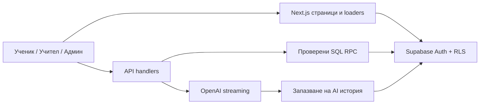

# Одит на Learning Lesson v2 — 3 октомври 2026

> Remediation branch: `fix/audit-2026-10-03`. See `docs/audit-remediation-2026-10-03.md` for status of each finding.

Проверката открива 17 конкретни находки за поправка, допълнителна условна граница в admin достъпа и няколко функционални пропуска. Приложението минава наличните автоматични проверки, но те не покриват едновременните заявки, прекъсната мрежа и реалния production RLS/AI поток.

Проверен код: GitHub `BobbyUzunov/Learning-Lesson`, `main`, commit `827c640e4cb15e05c9357dc85f83eda89cf7654a`. Vercel production показва същия commit и READY. Старата локална папка `/Users/bonchouzunov/Desktop/Cursor/learning-lesson-v2` липсва; използвано е временно независимо копие в `/tmp/learning-lesson-audit-20261003/learning-lesson-v2`.

Три агента провериха ученик/AI, учителски цикъл и сигурност/данни. Основният агент изпълни тестовете, сверява доказателствата, проверява production error поведението и зависимостите. Продуктовият код и продукционната база не са променяни. Не е правен deployment.

## Проверки и ограничения

| Проверка | Резултат |
| --- | --- |
| ESLint | успешно |
| TypeScript | успешно |
| Vitest | 100 файла, 590 успешни теста |
| Production build | успешно |
| Playwright | 63/63 успешни, Chromium, fake auth |
| Допълнителен mentor harness | 20/20 успешни; включва възпроизвеждане на две находки |
| Учителски component harness | възпроизведени стар missionId, различна бележка и заключена offline форма |
| Изолиран production error probe | оригиналният error компонент показва обща грешка вместо „Временно недостъпно“ |
| Публични live маршрути | /demo и /paths след redirect завършват с HTTP 200 |
| npm audit, production зависимости | 2 засегнати пакета: next critical, sharp high |
| Live Supabase introspection | недовършена: advisors връща hibernation, migrations/SQL връщат password authentication failed за postgres |
| Реални teacher/student/Auth/AI сесии | не са изпълнявани в този одит; няма налични отделни тестови акаунти |

Supabase management API описва проекта като ACTIVE_HEALTHY. Грешката в диагностичния достъп не доказва, че приложението е недостъпно. Публичният HTTP smoke не доказва автентикираните учебни потоци. SQL находките са спрямо последните дефиниции в migration веригата; текущите инсталирани production дефиниции не са сверени.

## Архитектура и функционално покритие

Архитектурата е Next.js App Router монолит с React UI, server loaders, API route handlers, Supabase Auth/Postgres/RLS/RPC и OpenAI streaming. Тази структура е подходяща за сегашния пилот; основният проблем е несъгласуваност между слоевете.

| Зона | Налична функционалност | Какво остава несигурно/непълно |
| --- | --- | --- |
| Ученик | вход, програма, лаборатории, „Днес“, клас, задачи, проверки, профил | приоритети на „Днес“, реално отчитане на серията, запазване на непредадени отговори |
| Учител | класове, код, roster, co-teachers, възлагане, reviews, assessments, дневник, CSV | последователно възлагане, offline/retry, бележки, конкурентно първо предаване |
| AI | дневна квота, 3 насоки по задача, история, effort, streaming | атомарност между quota/history/generation; дълги решения; failed/aborted persistence |
| Данни | RLS, server grading, protected XP/RPC, review history | тих fallback в някои loaders; live RLS smoke; непълен личен export |
| Админ | роли, CMS, reviews, allowlist в приложението | съгласуване на app allowlist с директния DB достъп |
| Инфраструктура | CI lint/typecheck/unit/build/E2E; Vercel READY | уязвими версии; CI няма реален Supabase/OpenAI поток |

Положителни граници от кода: signup metadata не дава teacher/admin роля; protected role-change RPCs са ограничени; fake auth е изключен във Vercel; CSV използва защита срещу формули; knowledge-check XP се проверява на сървъра; assessment student RPC не връща answer keys; съществуващите submission редове се заключват при review/resubmit; старият feedback се запазва в private history. Не е открит нов кодов път за student→admin ескалация в проверения обхват. Това не е live penetration-test удостоверение.

## Находки, подредени за поправка

P1: поправка преди разширяване на пилота. P2: функционална поправка в следващия стабилизационен цикъл. P3: по-малка UX несъгласуваност. Приоритетът е продуктова оценка, отделно от severity на външните advisories.

### F01 — P1: остарели production зависимости с публикувани advisories

`package.json` фиксира Next.js 15.5.22 и override Sharp 0.35.3. `npm audit --omit=dev` отчита next critical и sharp high. Advisory за Next.js AVIF image optimization засяга версии под 15.5.24; Sharp libheif advisory засяга версии под 0.35.4. Windows-specific Next.js advisory има отделно условие Windows filesystem и не е доказан приложим към текущия Vercel deployment.

Няма опит за експлоатация. Не е установено, че атакуващ може да подаде AVIF през текущата конфигурация; няма зададени remote image patterns. Засегнатите версии са потвърдени, exploitability в това приложение остава за проверка.

Поправка: patch обновяване на Next.js и eslint-config-next заедно, плюс Sharp override минимум 0.35.4; commit на lockfile, production build/image smoke и повторен npm audit. npm предлага Next.js 15.5.27.

Източници: [Next.js AVIF advisory](https://github.com/vercel/next.js/security/advisories/GHSA-2xp9-vwfh-vxw4), [Sharp advisory](https://github.com/lovell/sharp/security/advisories/GHSA-rgj7-g3m4-5g8c), [Windows advisory](https://github.com/vercel/next.js/security/advisories/GHSA-p293-qw3h-jr36). Raw резултат: [/tmp/learning-audit-dependencies.json](/tmp/learning-audit-dependencies.json).

### F02 — P1: кратък rate-limit прозорец изтрива дългите ограничения

Местоположение: `supabase/migrations/20260831120000_security_grade_rate_limit_and_account.sql:41`.

`consume_http_rate_limit` изтрива всички events, по-стари от прозореца на текущия caller, без `bucket_key` филтър. Заявка с 60-секунден прозорец изтрива все още валидни events за 1-часовите signup/export/delete ограничения.

Поправка: чистене само на текущия bucket или глобално чистене по индивидуално записан expiry. Нужен SQL тест с два различни прозореца. Доказателство: кодова проверка, без live SQL възпроизвеждане.

### F03 — P1: две AI заявки харчат квотата два пъти и губят една насока

Местоположение: `src/app/api/mentor/route.ts:174`, `:194`, `:227`; unique constraint в `20260910120920_persist_assignment_mentor_hints.sql:15`.

Два таба четат една и съща празна история, резервират дневна квота независимо и генерират „насока 1“. Вторият INSERT нарушава unique(user, assignment, hint_level). След refresh се вижда само една насока, но са изразходвани две заявки.

Възпроизведено с действителния handler и mocked DB/model: два HTTP 200 отговора, две quota reservations, две генерации, вторият persistence callback се проваля.

Поправка: атомарна reservation на slot за user+assignment+level, заедно с дневната квота; idempotent повторения и видим pending/failed статус. Тест с два таба и реален DB transaction.

### F04 — P1: едновременни първи предавания заобикалят заключването

Местоположение: `supabase/migrations/20260903140000_lock_assignment_resubmit.sql:107`, `:170`.

При първо предаване няма ред за `FOR UPDATE`. Две заявки могат да минат проверката, а безусловният `ON CONFLICT DO UPDATE` на втората заменя вече предадения текст. Възможно е забавената заявка да изчисти и review state.

Поправка: transaction/advisory lock по student+assignment преди lookup, или conflict update само за допустими състояния с последващ надежден отказ. Очаквано: един успех и един отказ, оригиналният текст запазен.

Доказателство: SQL и валиден concurrent interleaving; не е изпълнен реален Postgres concurrency тест.

### F05 — P2: streak отчита посещения на „Профил“

Местоположение: `src/components/daily-streak-card.tsx:60`, `src/app/profile/page.tsx:73`, `src/app/dashboard/page.tsx:98`.

Единственият caller на /api/streak е компонентът в профила. Ученик може да използва задачи и уроци ежедневно без увеличаване на серията. „Днес“ показва старата стойност, включително след пропуснати дни.

Поправка: общ authenticated activity hook или запис при учебно действие, единна дневна граница и тестове за последователни/пропуснати дни без посещение на профила.

### F06 — P2: production DB грешката не показва „Временно недостъпно“

Местоположение: `src/app/error.tsx:24`, `:31`.

Компонентът разпознава outage чрез `error.message.includes("_unavailable")`. В production Server Components оригиналното съобщение е скрито, така че тази проверка е false. Изолирана Next.js production сглобка, използваща оригиналния компонент и `throw new Error("catalog_courses_unavailable")`, показва „Something went wrong“.

Допълнително `error.tsx` връща html/body вътре в root layout, което е структура за `global-error.tsx`. Няма отделен global-error за root-layout отказ.

Поправка: очакваните data outages да се представят като typed loader result и контролирано UI, или надежден server→client error contract; правилна segment boundary без html/body и отделен global-error. Тест върху production build.

Доказателство: [production screenshot](/tmp/learning-audit-db-error-production.png). Fixture: `/tmp/learning-audit-error-probe`; това е изолиран тестов екран без stylesheet на приложението, не снимка от live сайта.

### F07 — P2: тих fallback остава в лаборатории и проекти

Местоположение: `src/lib/curriculum/labs.ts:41`, `src/lib/projects/store.ts:28`.

DB error/празни резултати връщат checked-in lab links/projects. Това влияе върху мисии, /paths и изисквания за сертификат. Използва се `hasSupabaseEnv` вместо `hasSupabaseDataEnv`, така че fake-auth E2E може да опитва remote/example DB заявки.

Поправка: fallback само при изричен local/demo режим; разграничение между валидно празно съдържание и outage. Тест с грешка и тест с нарочно празен каталог проекти.

### F08 — P2: profile outage се представя като ученик с нула XP

Местоположение: `src/lib/supabase/auth.ts:47`.

Грешката от ensureUserProfile се игнорира и се създава profile с role=user, XP=0, streak=0. Учител може да изгуби учителската навигация при DB грешка; ученик вижда неверни нулеви данни.

Поправка: отделен недостъпен profile state и явна грешка, вместо фабрикуван успешен профил.

### F09 — P2: второто възлагане изпраща предишната мисия

Местоположение: `src/components/teacher/assign-mission-form.tsx:64`, `:135`, `:208`.

След възлагане A страницата премахва A от опциите, но router.refresh запазва missionId=A. При следващо отваряне select изглежда избрал B, докато POST изпраща A и получава assignment_exists.

Възпроизведено с действителния component/hook harness при A/B → success A → props B → повторно submit A.

Поправка: selection, винаги валиден спрямо текущите missions; тест с две последователни възлагания без refresh на цялата страница.

### F10 — P2: видимата учителска бележка не се изпраща

Местоположение: `src/components/teacher/assignment-report-table.tsx:82`, `:121`.

Textarea показва notes[id] ?? row.teacherNote, но payload изпраща notes[id] ?? "". Неизменена видима бележка става празна; връщането получава teacher_note_required, а при одобряване старият feedback може да се изчисти.

Възпроизведено с действителния компонент: видима „Existing teacher note“ → teacherNote="" в POST.

Поправка: една стойност за визуализация и payload; изрична политика за запазване на feedback при approval.

### F11 — P2: network error оставя форми заключени

Местоположение: `src/components/teacher/create-classroom-form.tsx:41`, `classroom-controls.tsx:43`, `classroom-students-list.tsx:41`, `src/components/delete-account-section.tsx:24`.

Rejected fetch няма catch/finally. Loading остава true и няма retry без reload. За CreateClassroomForm е възпроизведено: fetch rejects offline → disabled button. Останалите имат същия кодов път, без отделно динамично изпълнение.

Поправка: локализирана грешка, finally освобождаване, ясна разлика между неуспешна операция и успешно изтриване с failed sign-out.

### F12 — P2: AI отказва валидно решение над 1600 символа

Местоположение: `src/components/submit-assignment-form.tsx:90`, `:113`; `src/app/api/mentor/route.ts:139`.

Формата разрешава 10 000 символа текст и 2 000 URL, а mentor изпраща пълния текст като effort с лимит 1600. Решение с 1601 символа получава effort_too_long.

Възпроизведено с действителния POST handler. Поправка: явен excerpt за AI review или подравнено приемане/обобщаване с видима обратна връзка.

### F13 — P2: „Днес“ избира предадена задача пред незавършена

Местоположение: `src/app/dashboard/page.tsx:44`.

submitted се избира пред missing/draft. Ученик с A предадена и B за работа попада в A с заключена форма, вместо да отвори B. Inbox има различно подреждане.

Поправка: общ приоритет за hero и inbox — actionable returned/open/overdue работа пред waiting-for-review.

### F14 — P2: login redirect допуска външен адрес чрез backslash

Местоположение: `src/app/login/page.tsx:15`, `src/components/login-form.tsx:243`, `:258`.

redirect='/\\audit.example.invalid/path' минава startsWith('/') и !startsWith('//'). URL нормализацията го превръща във външен host, а router.replace може да навигира навън след login.

Доказателство: Node URL parsing и installed Next external-navigation код; няма реален login към външен сайт и няма доказано изтичане на токен.

Поправка: нормализиране спрямо собствен origin, origin equality, отказ на backslashes/control characters и връщане само на local pathname/search/hash.

### F15 — P2: личният export пропуска нови данни

Местоположение: `src/app/api/account/export/route.ts:39`, `src/lib/account/build-export.ts`.

Липсват AI history/effort, assessment answers/results, исторически assignment reviews, consent metadata и project review_notes. Export може да върне success въпреки липсите.

Поправка: inventory на личните данни и ownership-filtered export; тесен authorized RPC за private history. Тест с записи във всички категории.

### F16 — P2: repair на липсващ profile противоречи на SQL grants

Местоположение: `src/lib/supabase/profile.ts:71`; `20260717195604_harden_learning_platform.sql:489`.

Recovery insert включва role=user, но authenticated INSERT grant не включва role колоната. За legacy/imported акаунт без profile repair се отказва; нормалната регистрация с trigger не е засегната.

Поправка: role да се задава от защитения SQL default, без explicit role в client insert; интеграционен тест с липсващ profile.

### F17 — P3: co-teacher вижда недостъпни management бутони

Местоположение: `src/components/teacher/classroom-controls.tsx:69`; `20260725001000_harden_classrooms.sql:587`, `:632`, `:682`.

Archive, rotate code и enable/disable се виждат и за co-teacher, но SQL разрешава само owner/admin и връща 403.

Поправка: UI според реалните права, с ясно обяснение за ограничението.

## Условни рискове и продуктови решения

- **Admin allowlist:** Next.js отказва admin извън email allowlist, но SQL private.is_admin проверява role=admin. Ако allowlist се използва за отнемане на права от съществуващ admin, директният Supabase достъп остава разрешен. Това не дава admin роля на ученик. Нужен общ DB/app authorization модел и live проверка. Файлове: `src/lib/supabase/admin-auth.ts:30`, `20260717195604_harden_learning_platform.sql:314`.
- **Достоверност на AI историята:** authenticated може директно да INSERT собствена история по joined assignment, включително измислен hint/model/tokens. Няма доказана cross-user промяна или paid-generation bypass. Ако историята е учебно доказателство, записите трябва да са само server-generated.
- **„Нов опит“ в AI:** празен effort се пази като null; след refresh null означава „нов опит“ и може да позволи следваща насока без променена работа. Server-side policy липсва. Да се реши продуктово кога е позволена следващата насока.
- **Draft persistence:** непредадени assignment/assessment отговори се пазят в React state и се губят при refresh. Това е отделен функционален пропуск от AI history persistence.
- **Assessment duration:** показва се durationMinutes, но няма start time/countdown/enforcement. Да бъде означено като ориентировъчно време или да се реализира строг лимит.
- **Review history:** private audit trail съществува; липсва учителски UI за преглед на предишни версии/feedback.
- **Мащабиране:** gradebook прави RPC за всяка задача/assessment. Това е риск при голям класен журнал, а не измерена текуща повреда.
- **Документация:** README все още описва mentor в lesson task и guest lesson completion, докато текущият UI използва mentor в assigned mission и отделно публично demo. Старият full-audit документ има остарели counts и readiness твърдения.
- **School tenancy, 9–12 клас, bulk assign, push/calendar:** roadmap функционалности; не са регресии в текущия VIII клас пилот.

## Предложен ред за работа и приемане

1. Patch dependencies (F01), rate-limit изолация (F02), атомарни submission/mentor операции (F03/F04). Проверка с реални едновременни DB transactions.
2. Дневен работен поток: streak, „Днес“, последователно възлагане, teacher notes, AI effort лимит (F05/F09/F10/F12/F13).
3. Устойчивост: typed outage UI, всички DB loaders/profile errors, offline forms и retry (F06/F07/F08/F11/F16).
4. Access/export: безопасен redirect, пълен export, co-teacher UI и DB/app admin contract (F14/F15/F17 + условния admin риск).
5. Реален интеграционен smoke с отделни disposable accounts: owner, co-teacher, ученик, чужд учител; live hint persistence + reload; отрицателни RLS сценарии; cleanup с нулев остатък.

Зелените 590 unit и 63 fake-auth E2E теста не валидират реалната SQL конкурентност или OpenAI completion persistence. Съществуващият `integration/classroom-cycle.spec.ts` е добър старт, но в този одит не е изпълнен. Предишният му успешен резултат от 8 септември е историческо доказателство, не текущ тест.

Артефакти за допълнителното AI възпроизвеждане: `/tmp/learning-lesson-student-audit-checks/mentor-audit.test.ts` и `vitest.config.mts`. Production error fixture: `/tmp/learning-audit-error-probe`. Всички са тестови артефакти извън продуктовия код.

